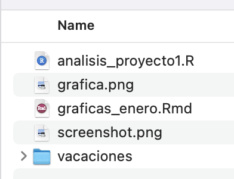
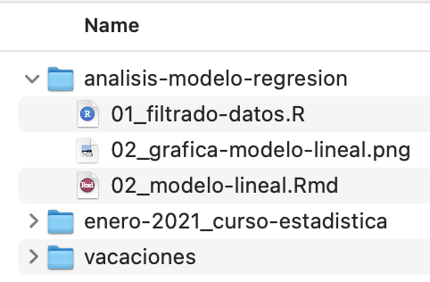
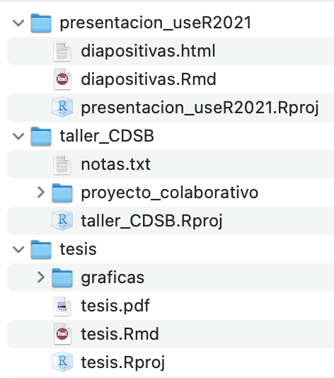
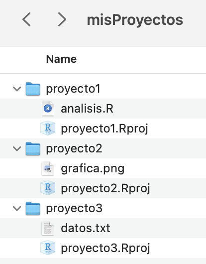
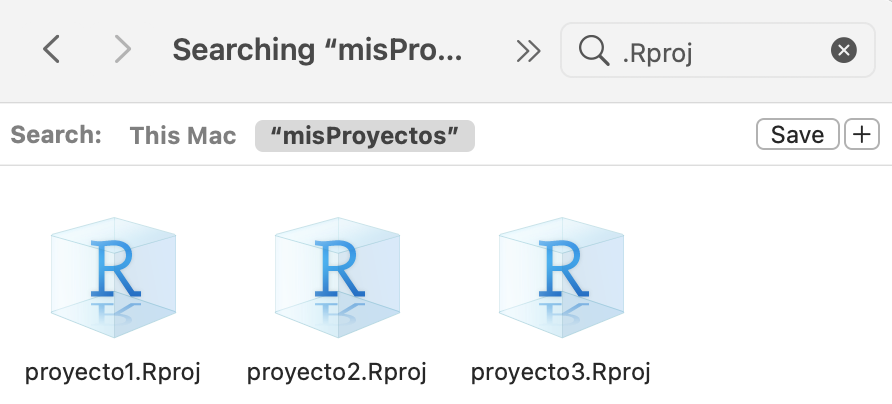
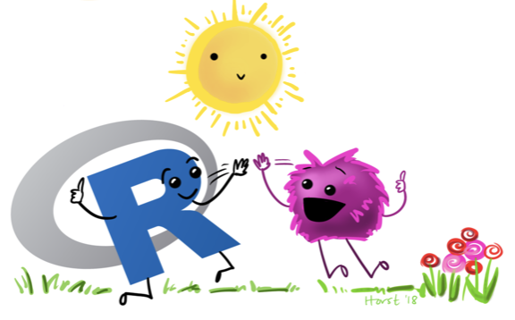

# ¿Qué es un proyecto de RStudio?
<br><br>

- Es un archivo especial de R, compatible con RStudio, que al ejecutarlo hará 3 cosas:

  - Abrirá una nueva sesión de RStudio.
  
  - Establecerá la ubicación del proyecto como tu directorio de trabajo.
  
  - Establecerá la ubicación del proyecto como la raíz de los archivos.

---
# ¿Por qué usar proyectos de RStudio?

## Te permiten ser más organizado

.pull-left[
```{r,echo=FALSE, out.width='90%'}

```
]

.pull-right[
```{r,echo=FALSE,  out.width='100%'}

```
]

---
# ¿Por qué usar proyectos de RStudio?

.pull-left[<br>
- ## Compartamentalizas tu trabajo. 

<br>
- ## Genera un proyecto por análisis.
]

.pull-right[
```{r,echo=FALSE,  out.width='90%'}

```
]
---
# ¿Por qué usar proyectos de RStudio?

## Puedes trabajar con varios proyectos a la vez.

```{r,echo=FALSE, out.width='90%', fig.align='center'}
knitr::include_graphics("img/multisesion.png")
```

---
# ¿Por qué usar proyectos de RStudio?

## Establece automáticamente tu directorio de trabajo.

.pull-left[
### Sin proyecto de RStudio

```{r,eval=FALSE}
setwd("Documentos/miproyecto")
```
]

.pull-right[
### Con proyecto de RStudio

- Ve a File > Open Project o a  
File > Open Project in New Session.
- Ejecuta ~/Documentos/miproyecto.Rproj.

- Si estás en tu terminal puedes usar:  
open ~/Documentos/miproyecto.Rproj
]

---
# ¿Por qué usar proyectos de RStudio?

## Puedes usar rutas relativas a los archivos.

.pull-left[
### Sin proyecto de RStudio

```{r}
read.csv("~/Documents/meetup_abril_2022/mitabla.csv")
```
]

.pull-right[
### Con proyecto de RStudio

```{r}
read.csv("mitabla.csv")
```
]

---
# ¿Por qué usar proyectos de RStudio?

## Facilita el compartir y reproducir tu trabajo

### Sin proyecto de RStudio

Esta ruta funcionará solamente en mi computadora.
```{r, eval=FALSE}
read.csv("~/Documents/meetup_abril_2022/mitabla.csv")
```

---
### Con proyecto de RStudio

Esta ruta funcionará en cualquier computadora que tenga el directorio completo del proyecto.
```{r, eval=FALSE}
read.csv("mitabla.csv")
```

---
# ¿Por qué usar proyectos de RStudio?

## Nos ayuda a establecer colaboraciones y trabajar con plataformas de control de versiones.

.pull-left[<br>
```{r, echo=FALSE,out.width='100%'}
knitr::include_graphics("img/GitHubLogo.png")
```
]

.pull-right[
```{r, echo=FALSE, out.width='80%'}
knitr::include_graphics("img/gitlablogo.jpg")
```
]

---
# ¿Cómo generamos un proyecto de RStudio?

## Opción 1:

- Creando un proyecto en un directorio nuevo:

  - En las opciones de RStudio Ve a File > New project > New Directory > New Project.
  - Asigna un nombre a tu proyecto, sin espacios y sin caracteres especiales.
  - Selecciona la ubicación donde crearás el nuevo directorio.
  - Selecciona la opción Open in New Session.
  - Oprime Create Project.

---

# Es tu turno! 

- Genera un proyecto de RStudio llamado ‘nuevodirectorio’ en un directorio nuevo en tus Documentos (~/Documentos).

---
# ¿Cómo generamos un proyecto de RStudio?

## Opción 2:

- Creando un proyecto en un directorio existente:
  
  - Crea un directorio en alguna ubicación conocida de tu computadora.
  - Asigna un nombre a tu directorio, sin espacios y sin caracteres especiales (Este será el nombre de tu proyecto).
  - En las opciones de RStudio ve a File > New project > Existing Directory.
  - Selecciona la ubicación donde previamente creaste el directorio.
  - Selecciona la opción Open in New Session.
  - Oprime Create Project.

---

# Es tu turno!

- Genera una carpeta o directorio llamado ‘directorioprevio’ en tus Documentos (~/Documentos)

- Después, genera un proyecto de RStudio usando este folder como base.

---

# ¿Cómo generamos un proyecto de RStudio?

## Opción 3:

- Creando un proyecto con control de versiones:

  - Crea un repositorio en GitHub o GitLab.
  - En las opciones de RStudio Ve a File > New project > Version control > Git.
  - Copia y pega la dirección URL del repositorio de Git creado previamente. (https://github.com/josschavezf/proyecto.git)
  - Selecciona la ubicación donde crearás el nuevo directorio.
  - Selecciona la opción Open in New Session.
  - Oprime Create Project.

---
# Algunos hacks!

.pull-left[
### RStudio recuerda los proyectos con los que has trabajado recientemente.

<br><br>
Esquina superior derecha de RStudio > click en la flecha junto al nombre de tu proyecto actual.

]

.pull-right[
```{r, echo=FALSE, out.width='90%'}
knitr::include_graphics("img/listprojects.png")
```
]

---
# Algunos hacks!

Crea todos tus proyectos dentro de una carpeta principal y usa el buscador de archivos para acceder a ellos rápidamente.

.pull-left[
```{r, echo=FALSE, out.width='60%', fig.align='center'}

```
]

.pull-right[
```{r, echo=FALSE, out.width='100%'}

```
]

---

# Es tu turno! 

Comprueba algunas ventajas de usar proyectos de RStudio.

- Genera un nuevo proyecto de RStudio llamado ‘miproyecto’
- Cierra la sesión y vuelve a abrirla ejecutando desde la terminal open miproyecto.Rproj o dando doble click sobre el archivo miproyecto.Rproj.
- Evalúa tu directorio de trabajo con el comando getwd().
- Cierra la sesión y mueve toda la carpeta de tu proyecto a otra ubicación. 
- Abre nuevamente el proyecto y verifica el directorio de trabajo.
- Sin cerrar este proyecto, abre alguno de los proyectos que generaste previamente .


---

# Buenas práticas para ordenar tu proyecto

.pull-left[<br>
Genera carpetas con:

- Entradas (datos originales y datos filtrados).

- Procedimientos (Rscripts con el filtrado, manejo de datos, análisis, generación de gráficas).

- Salidas (Gráficas generadas y resultados).
]

.pull-right[
```{r, echo=FALSE, out.width='65%'}
knitr::include_graphics("img/proyecto1.png")
```
]

---

# Es tu turno! 

- Descarga la carpeta proyecto_desordenado desde <https://bit.ly/cdsb2021_workflows>  

- Ordena los archivos en subcarpetas, considera las recomendaciones mencionadas anteriormente.

---
# Utiliza las rutas adecuadas a los archivos

Ahora que has reorganizado tu proyecto, debes usar las rutas relativas para importar y exportar tus archivos en sus directorios correspondientes.

Recuerda que la raiz de tu proyecto será el directorio principal.

Por ejemplo:

.pull-left[<br>
```{r, eval=FALSE}
read.table("datos/mis_datos.txt",
           header = TRUE)
```
]

.pull-right[
```{r,echo=FALSE,out.width='80%',fig.align='center'}
knitr::include_graphics("img/rutas.png")
```
]

---

# Es tu turno!

- Con tu proyecto ordenado, abre el archivo analisis.R y corrige las rutas a los archivos considerando los subdirectorios que creaste.


---

.left-column[<br><br><br><br><br>
# Rutas seguras con el paquete here
]

.right-column[<br>
```{r, echo=FALSE, out.width='100%', fig.align='right'}
knitr::include_graphics("img/here.png")
```
.center[Ilustración de Allison Horst]
]

---
# Base estable

Las rutas seguras con **here** se construyen en relación a una base estable

.center[base estable = dirección del .Rproj]

--
<br>
```{r}
here::here("datos/datos_crudos.csv")
here::here("datos", "datos_crudos.csv")
```

---
# Podemos acceder a los niveles de subcarpetas necesarios

```{r}
here::here("datos", "subcarpeta" ,"misdatos.csv")
```

--

```{r}
read.csv(here::here("datos", "subcarpeta" ,"misdatos.csv"))
```

---

```{r}
mi_ruta <- here::here("datos", "subcarpeta" ,"misdatos.csv")

read.csv(mi_ruta)
```

---
# Ventajas

- La ruta sigue funcionando si compartes el código o mueves la carpeta.

- Funciona incluso cuando el directorio es una carpeta anidada.

- Funciona para proyectos de RStudio, repositorios de git y paquetes  de R.

- Funciona con archivos de R markdown.

---
## Probando here con R markdown

<br><br>
- Abre el archivo prueba_here.Rmd 

- Cómo se ven las rutas?

--
- Mueve este archivo a la subcarpeta datos

- Siguen funcionando las rutas?

---

# Es tu turno!

- Con tu proyecto ordenado, abre el archivo analisis.R

- Modifica las rutas a los archivos usando el paquete here


---

.left-column[<br><br><br><br><br><br><br>
.center[
# ¡Gracias!
]
]

.right-column[<br><br><br><br>
```{r,echo=FALSE,out.width='100%',fig.align='center'}

```

.pull-right[Ilustración de Allison Horst]
]
